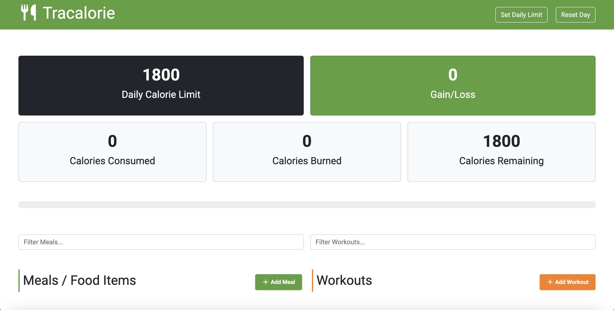

# Tracalorie - Calorie Tracking App

A modern, responsive calorie tracking web application built with JavaScript, Webpack, and Bootstrap. Track your daily meals and workouts to maintain a healthy lifestyle and stay within your calorie goals.



## 🚀 Live Demo

[View Live Demo](https://cal-fuel-log.netlify.app/)

## ✨ Features

- **Calorie Limit Setting**: Set and customize your daily calorie limit
- **Meal Tracking**: Add meals with names and calorie counts
- **Workout Tracking**: Log workouts and burned calories
- **Real-time Calculations**: Automatic calculation of consumed, burned, and remaining calories
- **Progress Visualization**: Visual progress bar showing calorie intake vs. limit
- **Persistent Storage**: Data saved locally using browser's `localStorage`
- **Search and Filter**: Filter meals and workouts by name
- **Responsive Design**: Works on desktop and mobile devices
- **Bootstrap UI**: Clean, modern interface with Bootstrap components

## 🛠️ Tech Stack

- **JavaScript (ES6+)**: Modern JavaScript with classes, modules, and async/await
- **Webpack**: Module bundling and development server
- **Bootstrap**: Responsive CSS framework and components
- **FontAwesome**: Icons for enhanced UI
- **Babel**: JavaScript transpilation for browser compatibility
- **HTML**: Semantic markup
- **CSS**: Custom styling and responsive design

## 📋 Prerequisites

- Node.js
- npm package manager

## 🔧 Installation

1. **Clone the repository**

   ```bash
   git clone https://github.com/philipstubbs13/tracalorie.git
   cd tracalorie
   ```

2. **Install dependencies**

   ```bash
   npm install
   ```

3. **Start development server**

   ```bash
   npm run dev
   ```

4. **Build for production**
   ```bash
   npm run build
   ```

## 🎯 Usage

1. **Set Calorie Limit**: Enter your daily calorie goal in the limit form
2. **Add Meals**: Click "Add Meal" to log food consumption with name and calories
3. **Add Workkouts**: Click "Add Workout" to track exercise and burned calories
4. **Monitor Progress**: View real-time updates of consumed, burned, and remaining calories
5. **Filter Items**: Use the search boxes to filter meals or workouts by name
6. **Reset Data**: Clear all data with the reset button

## 🏗️ Project Structure

```
tracalorie-webpack/
├── src/
│   ├── app.js              # Main application logic
│   ├── Tracker.js          # Calorie tracking core functionality
│   ├── Item.js             # Meal and Workout class definitions
│   ├── Storage.js          # localStorage management
│   ├── index.html          # Main HTML template
│   └── css/
│       ├── bootstrap.css   # Bootstrap framework
│       └── style.css       # Custom styles
├── webpack.config.js       # Webpack configuration
├── package.json            # Project dependencies and scripts
└── README.md
```

## 💡 Key Features & Implementation

### Object-Oriented Design

- **Meal and Workout Classes**: Encapsulated data structures with unique IDs
- **CalorieTracker Class**: Central hub for all calorie calculations and UI updates
- **Storage Class**: Handles all `localStorage` operations

### Modern JavaScript Features

- ES6 Classes and Modules
- Arrow functions and destructuring
- Template literals and spread operator
- Async/await patterns

### Webpack Configuration

- Module bundling with Babel transpilation
- Development server with hot reloading
- Production builds with minification
- CSS extraction and optimization

### Responsive UI/UX

- Bootstrap grid system for layouts
- Modal dialogs for form inputs
- Collapsible sections for better organization
- FontAwesome icons for visual enhancement

## 🔍 Skills Demonstrated

- **Frontend Development**: HTML, CSS, JavaScript
- **Modern JavaScript**: ES6+ features, classes, modules
- **Build Tools**: Webpack configuration and optimization
- **UI Frameworks**: Bootstrap 5 implementation
- **State Management**: Client-side data persistence
- **DOM Manipulation**: Dynamic content updates
- **Event Handling**: Form submissions, clicks, keypresses
- **Responsive Design**: Mobile-first approach
- **Version Control**: Git workflow and best practices

## 🚀 Future Enhancements

- [ ] User authentication and cloud storage
- [ ] Data visualization with charts
- [ ] Meal/workout templates and presets
- [ ] Export data to CSV/PDF
- [ ] Integration with nutrition APIs
- [ ] Progressive Web App (PWA) features
- [ ] Dark mode toggle
